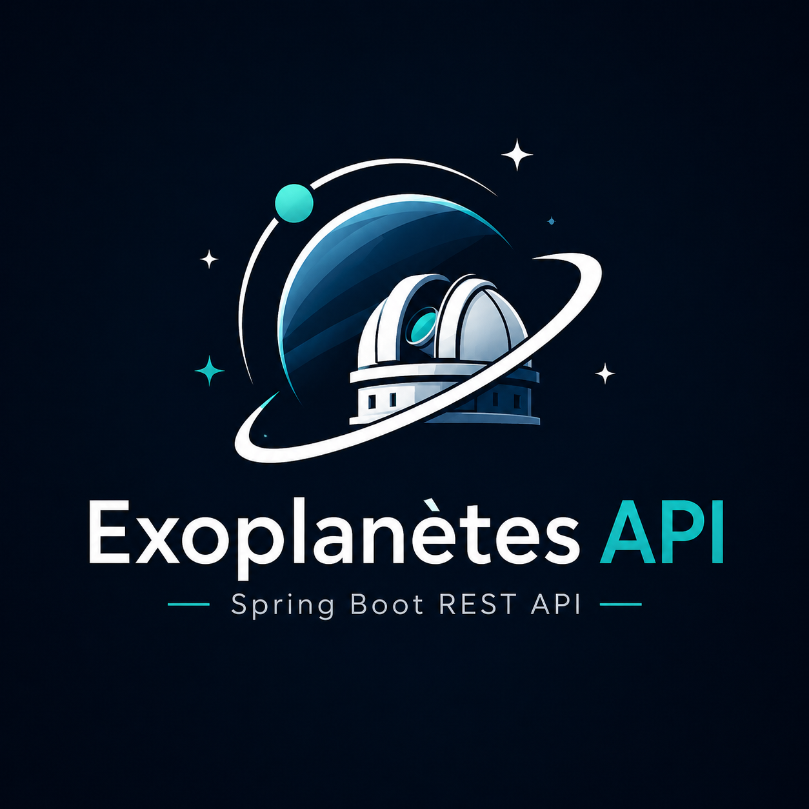

# 🔭 Exoplanètes API

API REST de gestion d'observatoires astronomiques et d'exoplanètes, construite avec **Java 21** et **Spring Boot 3**. Architecture en couches, persistance via **JPA/Hibernate**, migrations **Flyway**, documentation **OpenAPI/Swagger**.

<center><center/>

> Projet réalisé pour approfondir la maîtrise de Spring Boot et de JPA/Hibernate : mapping de relations, dirty checking, gestion de la concurrence, gestion d'erreur normalisée.

## Sommaire

- [Aperçu](#aperçu)
- [Stack technique](#stack-technique)
- [Domaine métier](#domaine-métier)
- [Fonctionnalités](#fonctionnalités)
- [Démarrage rapide](#démarrage-rapide)
- [Documentation de l'API](#documentation-de-lapi)
- [Points techniques notables](#points-techniques-notables)
- [Architecture](#architecture)

## Aperçu

Cette API expose un CRUD complet sur deux ressources liées par une relation N–1 (une exoplanète appartient à un observatoire), avec pagination, filtrage, mise à jour partielle, transitions de statut métier et gestion optimiste de la concurrence. Toutes les erreurs sont renvoyées au format **RFC 7807 (ProblemDetail)**.

## Stack technique

| Domaine | Technologies |
|---|---|
| Langage | Java 21 |
| Framework | Spring Boot 3.3 (Web, Data JPA, Validation) |
| Persistance | Hibernate, PostgreSQL 16 |
| Migrations | Flyway |
| Documentation | springdoc-openapi (Swagger UI) |
| Tests | JUnit 5, Testcontainers |
| Build | Maven |
| Qualité | SonarCloud |

## Domaine métier

Un **observatoire** découvre plusieurs **exoplanètes**. Chaque exoplanète suit un cycle de vie : `CANDIDATE` → `CONFIRMEE` ou `REJETEE`.

| Table | Champs clés |
|---|---|
| `observatoire` | `id`, `nom` (unique), `pays`, `altitude_m` |
| `exoplanete` | `id`, `designation` (unique), `masse_terre`, `distance_al`, `statut`, `observatoire_id` (FK), `version` (verrou optimiste) |

## Fonctionnalités

- **CRUD complet** sur les exoplanètes et les observatoires
- **Filtrage** par observatoire et **pagination** (`?observatoireId=&page=&size=`)
- **Mise à jour partielle** (PATCH) via le dirty checking d'Hibernate
- **Transitions de statut** métier (`/confirm`, `/reject`) avec règles de validation
- **Verrouillage optimiste** (`@Version`) contre les modifications concurrentes
- **Gestion d'erreur centralisée** (RFC 7807) : `400` / `404` / `409` / `422` / `500`
- **Validation** des entrées (Bean Validation)
- **Documentation interactive** OpenAPI / Swagger UI

## Démarrage rapide

### Pré-requis
- Java 21+
- Docker (pour PostgreSQL et Testcontainers)

### Lancer

```bash
# 1. Démarrer PostgreSQL
docker compose up -d

# 2. Lancer l'application (Flyway crée le schéma + un jeu de données)
./mvnw spring-boot:run
```

L'API est disponible sur `http://localhost:8080`.

### Tester

```bash
./mvnw test
```

Les tests d'intégration démarrent un PostgreSQL éphémère via Testcontainers (aucune base à installer, seul un daemon Docker est requis).

## Documentation de l'API

Une fois l'application lancée :

- **Swagger UI** : http://localhost:8080/swagger-ui/index.html
- **Spécification OpenAPI (JSON)** : http://localhost:8080/v3/api-docs

### Principaux endpoints

| Méthode | Endpoint | Description |
|---|---|---|
| `GET` | `/api/exoplanetes` | Lister (filtrable, paginé) |
| `GET` | `/api/exoplanetes/{id}` | Consulter |
| `POST` | `/api/exoplanetes` | Créer |
| `PATCH` | `/api/exoplanetes/{id}` | Mise à jour partielle |
| `DELETE` | `/api/exoplanetes/{id}` | Supprimer |
| `POST` | `/api/exoplanetes/{id}/confirm` | Confirmer une candidate |
| `POST` | `/api/exoplanetes/{id}/reject` | Rejeter une candidate |
| `GET` | `/api/observatoires` | Lister |
| `GET` | `/api/observatoires/{id}` | Consulter |
| `POST` | `/api/observatoires` | Créer |

### Exemple

```bash
# Créer une exoplanète (201 + header Location)
curl -i -X POST http://localhost:8080/api/exoplanetes \
  -H 'Content-Type: application/json' \
  -d '{"designation":"HD 189733 b","masseTerre":363.0,"distanceAl":64.5,"observatoireId":4}'
```

## Points techniques notables

Quelques choix d'implémentation représentatifs du projet :

- **Séparation stricte entité / DTO** : les entités JPA ne sont jamais exposées en JSON ; des records DTO dédiés servent en entrée et en sortie.
- **Mise à jour partielle par dirty checking** : le PATCH charge l'entité managée dans une transaction et laisse Hibernate générer l'`UPDATE`, sans SQL manuel.
- **Concurrence** : le verrouillage optimiste (`@Version`) détecte les modifications concurrentes et renvoie un `409`.
- **Transitions d'état** : les changements de statut passent par des endpoints métier dédiés qui valident les transitions autorisées (approche liste blanche), plutôt que par une modification de champ libre.
- **Erreurs normalisées** : un `@RestControllerAdvice` unique traduit les exceptions en `ProblemDetail` (RFC 7807), sans fuite de stack trace.
- **Schéma piloté par Flyway** avec `ddl-auto=validate` : Hibernate valide les entités contre le schéma mais ne le modifie jamais.

## Architecture

Découpage en couches, injection par constructeur, transactions gérées au niveau service.

**Controller → Service → Repository → PostgreSQL**

- **Controller** : expose les endpoints REST, valide les entrées, ne contient aucune logique métier.
- **Service** : logique métier, transactions (`@Transactional`, `readOnly` sur les lectures), mapping entité ↔ DTO.
- **Repository** : accès aux données via Spring Data JPA.

Configuration notable : `open-in-view=false` (session Hibernate fermée hors transaction) et `ddl-auto=validate` (le schéma est piloté uniquement par Flyway).

## Roadmap

- [ ] Tests d'intégration complets (endpoints)
- [ ] Déploiement (Docker + AWS Lightsail)
- [ ] Internationalisation des messages de validation